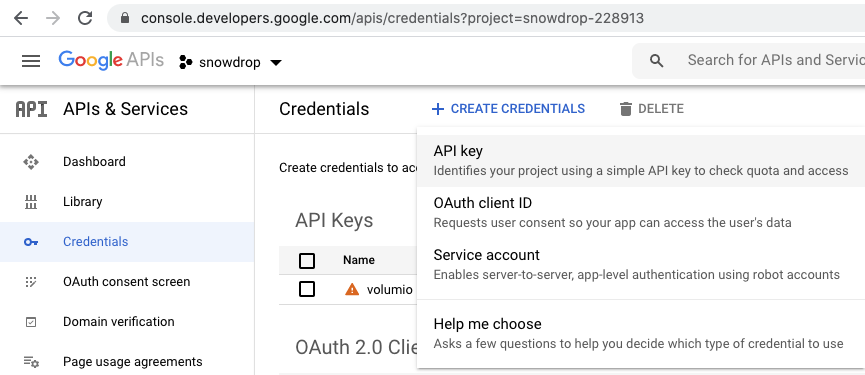

## Volumio

Table of Contents
=================

   * [Enable SSH](#enable-ssh)
   * [Define static IP Address](#define-static-ip-address)
   * [YouTube plugin](#youtube-plugin)
      * [Step by step instructions using official plugin](#step-by-step-instructions-using-official-plugin)
      * [Step by step instructions using forked Youtube plugin](#step-by-step-instructions-using-forked-youtube-plugin)
         * [SSH and install the plugin](#ssh-and-install-the-plugin)
         * [Create Google API Key](#create-google-api-key)
         * [Configure the Youtube plugin](#configure-the-youtube-plugin)


### Enable SSH

- To enable ssh and been able to access volumio remotely, follow the instructions as defined here: https://volumio.github.io/docs/User_Manual/SSH.html
- To avoid having to type every time the `volumio` password, copy securely your public key:
  
  `ssh-copy-id -i ~/.ssh/id_rsa.pub volumio@volumio.local`
  
### Define static IP Address

If an `IP static address` is needed to access volumio, the ` /etc/network/interfaces` file can be edited manually as described [here](https://community.volumio.org/t/volumio-2-and-static-ip-addresses/3828/5), otherwise
you can also use the UI and define it manually - `http://volumio.local/plugin/system_controller-network`

  

**REMARK**: Please enable the `Full Settings Mode` under the `system settings` - `http://volumio.local/plugin/system_controller-system`

### YouTube plugin

Review discussion and explanation to set up the Google Developer API Key/token which is needed:
https://community.volumio.org/t/plugin-youtube-for-volumio/5990/270

#### Step by step instructions using official plugin

- Get the youtube plugin: 

    `wget http://volumio.github.io/volumio-plugins/plugins/volumio/armhf/music_service/youtube/youtube.zip`

- Now we need to create a folder:

    `mkdir youtube`

- Now we are going to unzip the compressed file we just downloaded:

    `miniunzip youtube.zip -d youtube`

- Now change directory:

    `cd youtube`

- From here we can [install the plugin](https://volumio.github.io/docs/Plugin_System/Plugin_System_Overview.html) with the following command:
  **Remark**: If the plugin has already been installed, remove the entry from the plugins config file `/data/configuration/plugins.json`
  , next remove the folder `/data/plugins/music_service/youtube/` and dont forget to reboot.
  ```
  volumio plugin install
  This command will install the plugin on your device
  
  Compressing the plugin
  Plugin succesfully compressed
  Progress: 10
  Status :Downloading plugin
  Downloading plugin at http://127.0.0.1:3000/plugin-serve/youtube.zip
  Progress: 30
  Status :Creating install location
  Downloading plugin at http://127.0.0.1:3000/plugin-serve/youtube.zip<br>END DOWNLOAD: http://127.0.0.1:3000/plugin-serve/youtube.zip<br>Creating install location
  Progress: 40
  Status :Unpacking plugin
  Downloading plugin at http://127.0.0.1:3000/plugin-serve/youtube.zip<br>END DOWNLOAD: http://127.0.0.1:3000/plugin-serve/youtube.zip<br>Creating install location<br>Unpacking plugin
  Progress: 50
  Status :Checking for duplicate plugin
  Downloading plugin at http://127.0.0.1:3000/plugin-serve/youtube.zip<br>END DOWNLOAD: http://127.0.0.1:3000/plugin-serve/youtube.zip<br>Creating install location<br>Unpacking plugin<br>Checking for duplicate plugin
  Progress: 60
  Status :Copying plugin to location
  Downloading plugin at http://127.0.0.1:3000/plugin-serve/youtube.zip<br>END DOWNLOAD: http://127.0.0.1:3000/plugin-serve/youtube.zip<br>Creating install location<br>Unpacking plugin<br>Checking for duplicate plugin<br>Copying plugin to location
  Progress: 70
  Status :Installing necessary utilities
  Downloading plugin at http://127.0.0.1:3000/plugin-serve/youtube.zip<br>END DOWNLOAD: http://127.0.0.1:3000/plugin-serve/youtube.zip<br>Creating install location<br>Unpacking plugin<br>Checking for duplicate plugin<br>Copying plugin to location<br>Installing necessary utilities
  Progress: 70
  Status :Installing necessary utilities
  Downloading plugin at http://127.0.0.1:3000/plugin-serve/youtube.zip<br>END DOWNLOAD: http://127.0.0.1:3000/plugin-serve/youtube.zip<br>Creating install location<br>Unpacking plugin<br>Checking for duplicate plugin<br>Copying plugin to location<br>Installing necessary utilities<br>Installing youtube
  Progress: 90
  Status :Finalizing installation
  Downloading plugin at http://127.0.0.1:3000/plugin-serve/youtube.zip<br>END DOWNLOAD: http://127.0.0.1:3000/plugin-serve/youtube.zip<br>Creating install location<br>Unpacking plugin<br>Checking for duplicate plugin<br>Copying plugin to location<br>Installing necessary utilities<br>Installing youtube<br>Finalizing installation
  Progress: 100
  Status :Youtube Playback Successfully Installed, Do you want to enable the plugin now?
  Downloading plugin at http://127.0.0.1:3000/plugin-serve/youtube.zip<br>END DOWNLOAD: http://127.0.0.1:3000/plugin-serve/youtube.zip<br>Creating install location<br>Unpacking plugin<br>Checking for duplicate plugin<br>Copying plugin to location<br>Installing necessary utilities<br>Installing youtube<br>Finalizing installation<br>Finalizing installation
  ```
- Now we need to update the node package - `ytdl-core`: 
  
  ```
  cd /data/plugins/music_service/youtube/
  npm install ytdl-core@latest
  npm WARN youtube@1.0.1 No repository field.
  
  + ytdl-core@4.0.3
  updated 4 packages in 16.455s
  ```
  
- Enable the Youtube the plugin using Volumio UI
- Click on the `log` button, and you will be redirected to Google to select/authorize your GMail account  

#### Step by step instructions using forked Youtube plugin

The previous instructions relies on the official plugin managed under the github [project](https://github.com/volumio/volumio-plugins/tree/master/plugins/music_service/youtube)
and where the `Google API Youtube node package` is used to `OAuth` the user using your [Google Account](https://github.com/volumio/volumio-plugins/blob/master/plugins/music_service/youtube/index.js#L923)

Due to recent changes to the way that Youtube accepts remote applications to access their platform, the approach described with the official Volumio plugin will fail and this 
is the reason why it is needed to use a Google API key/ClientID/SecretID authorized to access the following scope:
```
YouTube Data API v3	.../auth/youtube.readonly	View your YouTube account
``` 
Such an approach has been implemented within the following github project of `patrickkfkan` - `https://github.com/patrickkfkan/volumio-plugins/`
and instructions to install it like to create the Google API key are described hereafter: 

##### SSH and install the plugin

- ssh to your volumio pi server
```bash
ssh volumio@192.168.1.100
volumio@192.168.1.100's password:
                       ___
                      /\_ \                        __
         __  __    ___\//\ \    __  __    ___ ___ /\_\    ___
        /\ \/\ \  / __`\\ \ \  /\ \/\ \ /' __` __`\/\ \  / __`\
        \ \ \_/ |/\ \L\ \\_\ \_\ \ \_\ \/\ \/\ \/\ \ \ \/\ \L\ \
         \ \___/ \ \____//\____\\ \____/\ \_\ \_\ \_\ \_\ \____/
          \/__/   \/___/ \/____/ \/___/  \/_/\/_/\/_/\/_/\/___/

             Free Audiophile Linux Music Player - Version 2.0

          C 2015 Michelangelo Guarise - Volumio Team - Volumio.org


Volumio Debian GNU/Linux comes with ABSOLUTELY NO WARRANTY, to the extent
permitted by applicable law.
```
- Next, download the forked github project, unzip it and move to the folder of the youtube plugin
```bash
wget https://github.com/patrickkfkan/volumio-plugins/archive/master.zip
mkdir plugins
miniunzip master.zip -d plugins
cd plugins/volumio-plugins-master/plugins/music_service/youtube
```
- Install the volumio plugin using the volumio command line tool
```bash
volumio plugin install
```

- Move to the location where the plugin has been installed and next update one of the node package to use the latest `4.0.3`
```bash
cd /data/plugins/music_service/youtube/
rm -rf node_modules
npm install ytdl-core@latest
```
- Check that the `packages.json` file has been updated accordingly
```bash
volumio@volumio:/data/plugins/music_service/youtube$ cat package.json
{
	"name": "youtube",
	"version": "0.1.0",
	"description": "Youtube playback and public sharing for the Volumio",
	"main": "index.js",
	"scripts": {
		"test": "echo \"Error: no test specified\" && exit 1"
	},
	"author": "Cris Pintea <cris@pintea.net>, Stefan Laesser <sla89@gmx-topmail.de> (reworked by Patrick Kan <patrickkfkan@gmail.com>)",
	"license": "MIT",
	"volumio_info": {
		"prettyName": "Youtube Playback",
		"plugin_type": "music_service",
		"icon": "fa-youtube",
		"boot_priority": 10
	},
	"dependencies": {
		"googleapis": "45.0.0",
		"iso8601-duration": "1.0.6",
		"kew": "0.7.0",
		"md5": "2.2.1",
		"node-cache": "5.0.1",
		"v-conf": "^1.4.0",
		"ytdl-core": "^4.0.3"
	}
}
```

##### Create Google API Key

- Create a Google Api Key to able to access the `Youtube Data API` with the help the google developer console `https://console.developers.google.com/`.

  **WARNING**: Use a Google Suite user to perform the following steps otherwise it will not be possible to register the API as an `internal` application
  but only as an `external` application that Google must approve and where it is needed to have `URLs` they can be accessed remotely to approve your request !!
  
- From the left menu, click on the `dashboard` button

  

  if not yet done, enable the `YouTube Data API v3` API/Service by clicking on the `+ Enable APIS and Service` button
  
  
  
- Select from the library `YouTube Data API v3` and click on the button `Enable`

  
  
- From the left menu, click on the `Credentials` button and select from the popup list - `Api Key`

  
  
- An api key will be generated as showed hereafter

  

- Within the screen listing the different `credentials`, select the one which has been created and rename it to `volumio`

  
  
- From the left menu, click on the `Credentials` button; next on the button `+ CREATE CREDENTIALS` and select `OAuthClient ID` from the popup list
- Select as `application type`, `Desktop App` and name it `volumio-youtube-USERNAME`

  
  
- When this process is done, it is needed to let the API to be able to access the `Youtube Data API` to read/view content
  So from the left menu, click on the `Oauth Consent Screen` button, and next edit the application by clicking on the button `edit app`
  
  
  Add your email address as requested and specify the name of the application: `volumio`
  
  
  
- Click on the button `Save and continue` and next click on the button `add or remove scopes` to select `.../auth/youtube.readonly`

  

  

  
    
  Finally click on `save and continue` button. You have finished :-)
  
##### Configure the Youtube plugin

- Copy from the Credentials screen the `API Key` screen of the `Volumio key` 
- Next select under the list of the `Oauth2 Client ID`, the Client ID `volumio-youtube-USERNAME` and then you will be able to get the `client ID` and `Secret ID`
 
- It is time now to configure the `Youtube plugin` using the `Volumio UI` and to pass as parameters your `Api Key`, `client ID` and `Secret ID` 

  
